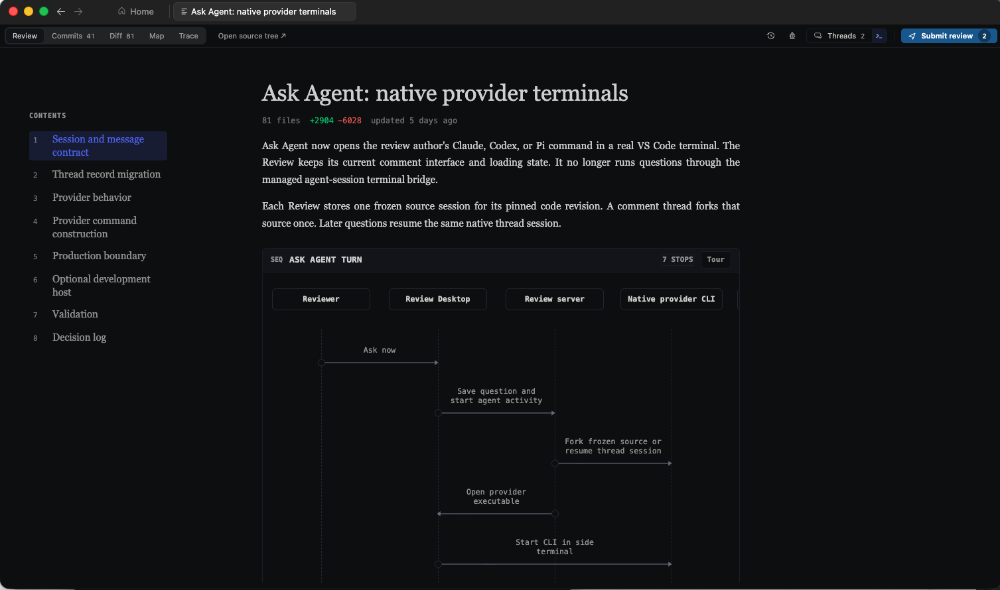

<div align="center">
  
  <h1>Review</h1>
  <p><strong>Cursor for code review.</strong></p>
  <p>
    <a href="https://install.dev.fast">Download for macOS</a> ·
    <a href="docs/README.md">Docs</a> ·
    <a href="https://dev.fast">Website</a> ·
    <a href="CONTRIBUTING.md">Contributing</a>
  </p>
</div>

Review is an open-source desktop app for understanding and reviewing
agent-written code. Coding agents turn a branch or pull request into a guided,
interactive Review connected to the exact code behind it.

Explore architecture and data flow, inspect diffs, ask questions, and explore
coding traces from one interface.

<p align="center">
  
</p>

<!-- prettier-ignore -->
> [!NOTE]
> Review is in beta and currently ships for macOS on Apple silicon.

## Quickstart

1. [Download Review](https://install.dev.fast) and open the app.
2. Connect Claude Code, Codex, and other coding agents from the welcome screen.
3. Ask your agent to review your current branch against up-to-date main and open
   the result in Review.

Review works especially well for large changes where a file-by-file diff does
not explain whether the system is right. See the
[quickstart](docs/quickstart.md) for the complete first-review flow.

## Documentation

[How Review works](docs/how-review-works.md) · [Coding agents](docs/agents.md) ·
[CLI](docs/cli-reference.md) · [Privacy](docs/privacy.md) ·
[Troubleshooting](docs/troubleshooting.md)

## Known limitations

- Review was engineered with reviewing changes to one repo. Your coding agent
  can obviously pull context from other repos on your machine, but we haven't
  engineered it to map architectural changes across repos. If you need this, let
  us know!
- Review doesn't properly handle stacked PRs right now, but this is coming soon.
- It's currently a pain to share reviews between machines; self-hostable
  collaboration tools are also on our roadmap.

_If there are any other features you need, feel free to ask on Discord or open
an issue or discussion!_

## FAQs

<details>
<summary><strong>Who is the Review app for?</strong></summary>

- If you still want the gains of generating code with AI but also want to
  understand how your codebase works and maintain quality, Review is for you.
- If you don't use AI to write a lot of code and are content reading diffs line
  by line, Review probably isn't for you.

</details>

<details>
<summary>
<strong>How is this different from Greptile, Bugbot, CodeRabbit, etc.?</strong>
</summary>

These tools review your LLM-generated code with another LLM. Review is a
complementary tool. Review doesn't review your code for you, but helps you
understand it and spot regressions quickly.

</details>

<details>
<summary><strong>How is this different from Plannotator?</strong></summary>

Plannotator is meant as an alternative to using the terminal for reviewing plans
and simple code diffs. Review takes some inspiration from Plannotator in its
lifecycle but is engineered as an opinionated framework for reviewing
AI-generated code diffs.

</details>

<details>
<summary><strong>How are you guys gonna make money on this?</strong></summary>

Eventually, we'll charge companies for a hosted Review product that manages
review creation alongside features like trajectory storage, review sharing,
etc., but everything will remain easily self-hostable.

</details>

## Development

Review requires Node.js 24 and pnpm 11. See the
[desktop prerequisites](apps/review-desktop/README.md#prerequisites), then run:

```sh
pnpm install
pnpm dev
```

Run `pnpm run ci` before submitting a pull request. See
[CONTRIBUTING.md](CONTRIBUTING.md) for more.

### A note on vendoring Code OSS

With everyone using dedicated agent TUIs and desktop apps, we only use our text
editors for reviewing line-by-line diffs now, so we figured why not have a text
editor meant for reviewing code. In that case, might as well start off with the
most successful open source editor out there as a baseline.

We vendor Code OSS unlike other forks that maintain patches because coding
agents have a hard time with patches and there's a lot of stuff from stock VS
Code (i.e., ~45% of the codebase is Copilot these days 😬) that we don't need.

We regularly monitor upstream Code OSS and merge in security/feature patches as
they come in.

## Privacy

Review runs against local checkouts. Anonymous telemetry does not include your
code, diffs, Review text, comments, questions, prompts, or model output. Read
the [privacy overview](docs/privacy.md), inspect the complete
[telemetry reference](docs/telemetry.md), or turn telemetry off at any time.

## License

Review is available under the [MIT License](LICENSE). The vendored Code - OSS
fork retains Microsoft's MIT license and third-party notices; see
[`apps/review-desktop/LICENSE`](apps/review-desktop/LICENSE) and
[`apps/review-desktop/UPSTREAM`](apps/review-desktop/UPSTREAM).

## Influences

- <https://www.geoffreylitt.com/2026/07/02/understanding-is-the-new-bottleneck>
  — a great overview of the constraints of modern software engineering.
- <https://maggieappleton.com/2025-08-vibe-legacy-code/> and
  <https://blog.val.town/vibe-code> — do a great job describing how AI-generated
  code fits into our pre-2025 notion of software engineering.
- We're big fans of Karpathy, so here are some of his banger tweets we love
  discussing:
  - On LLM agents: <https://x.com/karpathy/status/1979644538185752935>
  - On agents as "junior engineer savants":
    <https://x.com/karpathy/status/1915581920022585597>
