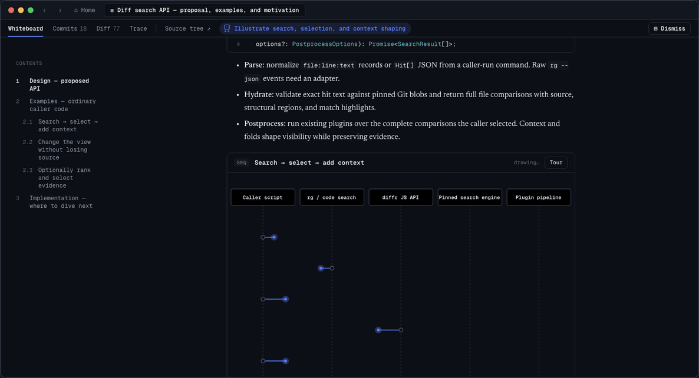

  
  <h1>Whiteboard</h1>
  
<strong>an open-source IDE for thoughtful software design</strong>

  

    <a href="https://install.dev.fast">Download for macOS</a> ·
    <a href="https://dev.fast">Website</a> ·
    <a href="https://discord.gg/wYvd2cpMQg">Discord</a>
  

We’re building Whiteboard, an open-source desktop app where humans and agents can architect software together in a common workspace.

Whiteboard plugs into the tools you already use - e.g. Claude Code, Codex, etc. – and gives your agent an SDK to draw on an in-app canvas to describe its work.

  

Here’s a 1 min demo video explaining more: https://youtu.be/n3bPlt2KzCA

## Quickstart

1. [Download Whiteboard](https://install.dev.fast) and open the app.
2. Connect Claude Code, Codex, or another coding agent from the welcome screen.
3. Ask your agent to review your current branch against up-to-date main and
   open the result in Whiteboard.

## How it works

### Built on top of CodeOSS

We found that pure HTML tools didn’t provide easy affordances to connect a spec, plan, or diagram to code; this is especially tricky since tradeoffs are often only discovered after a first pass at implementation. In Whiteboard, when you click on visualizations like a sequence diagram, an entity relationship diagram, or a quote from the agent’s trace, you can jump to the underlying code directly. When navigating code, you get keybindings and LSP support from VSCode out of the box. We take care to make sure these diagrams are rendered incrementally as well, as if someone was drawing them out for you.

With everyone using dedicated agent TUIs and desktop apps, we only use our text
editors for reviewing line-by-line diffs now, so we figured why not have a text
editor meant for reviewing code. In that case, might as well start off with the
most successful open source editor out there as a baseline.

We vendor Code OSS unlike other forks that maintain patches because coding
agents have a hard time with patches and there's a lot of stuff from stock VS
Code (i.e., ~45% of the codebase is Copilot these days 😬) that we don't need.

We regularly monitor upstream Code OSS and merge in security/feature patches as
they come in.

### Semantic diff viewer

Even with that, we found that a raw diff view was often too noisy, so we wrote a semantic, AST-aware diff viewer in Rust so you can only view the code changes which are relevant to you. We’ve set up some sane defaults: large added functions are summarized as pseudocode, and things like unit tests and documentation changes are collapsed. This is all customizable with a WASM-based plugin system.

### Decision Log

We found it difficult to reason about what set of decisions our agents made autonomously & how that impacts a change. So we built tools for agents to query and link their own traces on the Whiteboard, so you can visualize the requirements that you set, understand how they were implemented, and understand what decisions the agent made autonomously.

## Contributing

Please poke through and feel free to contribute! We would love to hear any feedback and to learn from your expertise.

Read [CONTRIBUTING.md](CONTRIBUTING.md) for setup and the pull request workflow,
and follow our [Code of Conduct](CODE_OF_CONDUCT.md). Report vulnerabilities as
described in [SECURITY.md](SECURITY.md). Questions? Ask on
[Discord](https://discord.gg/wYvd2cpMQg).

## Privacy

Whiteboard runs against local checkouts. Anonymous telemetry does not include
your code, diffs, Whiteboard text, prompts, or model output. Read the
[privacy overview](docs/privacy.md), inspect the complete
[telemetry reference](docs/telemetry.md), or turn telemetry off at any time.

## License

We’re releasing our desktop app under an MIT license. Eventually we’ll charge companies for a hosted product that manages session creation alongside features like trajectory storage and multiplayer reviews. Everything will always remain self-hostable.

Whiteboard is available under the [MIT License](LICENSE). The vendored Code -
OSS fork retains Microsoft's MIT license and third-party notices; see
[`apps/review-desktop/LICENSE`](apps/review-desktop/LICENSE) and
[`apps/review-desktop/UPSTREAM`](apps/review-desktop/UPSTREAM).

## Influences

- <https://www.geoffreylitt.com/2026/07/02/understanding-is-the-new-bottleneck>
  — a great overview of the constraints of modern software engineering.
- <https://maggieappleton.com/2025-08-vibe-legacy-code/> and
  <https://blog.val.town/vibe-code> — do a great job describing how AI-generated
  code fits into our pre-2025 notion of software engineering.
- We're big fans of Karpathy, so here are some of his banger tweets we love
  discussing:
  - On LLM agents: <https://x.com/karpathy/status/1979644538185752935>
  - On agents as "junior engineer savants":
    <https://x.com/karpathy/status/1915581920022585597>
