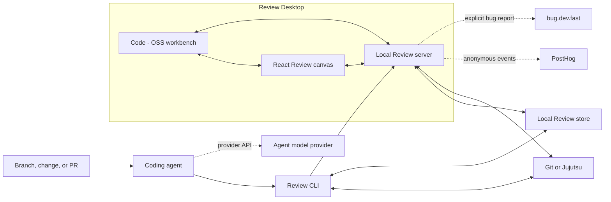

# Architecture

Review is a local-first desktop application with two main paths: an authoring
path, where a coding agent turns a change into a Review, and a reading path,
where a person explores that Review alongside live code and diffs.

This page is a contributor-level overview. For the product model, start with
[How Review works](how-review-works.md).

## System overview



Review does not run a model itself. The coding agent is an external author that
uses Review's skills and CLI. Its provider connection, credentials, and data
policy remain separate from Review.

## Core components

| Component | Responsibility | Main location |
| --- | --- | --- |
| Review CLI | Scaffolds Reviews, pins revisions, validates documents, publishes revisions, and manages threads and maps | `packages/progressive-review/src` |
| Review canvas | Renders agent-authored MDX, diagrams, maps, commits, threads, and Review controls | `packages/progressive-review/app/src` |
| Local Review server | Owns Home data, active sessions, authenticated APIs, event streams, document modules, thread state, and publication handoff | `packages/progressive-review/src/server` |
| Desktop workbench | Hosts the canvas and supplies editors, diffs, language services, menus, updates, and native app lifecycle | `apps/review-desktop/code-oss/src/vs/review` |
| Desktop packaging | Builds, runs, packages, signs, and releases the Code - OSS application | `apps/review-desktop` |
| Shared protocol | Defines and validates messages shared by the CLI, server, canvas, and workbench | `packages/review-protocol/src/contracts.ts` |
| Local VCS adapter | Provides Git and Jujutsu operations, notes storage, and locking without coupling the rest of Review to one VCS | `packages/local-vcs/src` |

## Authoring and publication

1. A coding agent runs `review scaffold` for a branch, Jujutsu change, or pull
   request. The CLI resolves exact base and head commits and prepares
   Review-owned checkouts.
2. The agent writes `review.mdx` and supporting TypeScript. Source links point
   to stable code targets rather than whichever checkout happens to be open.
3. `review publish` compiles the MDX, validates its schema and source targets,
   checks publication gates, and seals an immutable candidate revision.
4. If Review Desktop is running, the CLI discovers its local server and sends a
   `publish-ready` request.
5. Desktop materializes the candidate and mounts it off-screen. Only a clean
   first render promotes it into the visible Review. A failed candidate leaves
   the previous good revision untouched.

Software maps have a parallel publication path. They are stored per commit and
can be validated and promoted independently from the Review document.

## Desktop process model

Review Desktop is a purpose-built Code - OSS application, not a browser page in
an Electron wrapper.

- The Electron main process starts and supervises one Review server child
  process.
- The server listens on an operating-system-selected `127.0.0.1` port and
  writes an atomic discovery file containing its port, process identity, and a
  random access token.
- The workbench subscribes to global and session event streams over local HTTP
  and server-sent events.
- Opening a Review creates an in-memory session and mounts its pinned source
  checkout. Sessions share the one server; they do not open additional ports.
- The React canvas mounts directly into the workbench document. A typed bridge
  gives it native editors, diff views, comments, commands, theme updates, and
  authenticated access to the local server.

Home is global and has no repository open. Repository and language-service
state appears only after a Review session needs it.

## Local data

By default, `DEV_REVIEW_HOME` is `~/.dev`.

| Data | Location | Notes |
| --- | --- | --- |
| Authored Reviews | `${DEV_REVIEW_HOME}/reviews/<uuid>/` | Document source, metadata, thread database, sealed revisions, and disposable build output |
| Desktop discovery and profile | `${DEV_REVIEW_HOME}/review-desktop/` | Private discovery file and Code - OSS profile state |
| Telemetry queue and settings | `${DEV_REVIEW_HOME}/telemetry/` | Random installation ID and bounded event queue |
| Managed source checkouts | Repository shared Git directory under `dev-fast/reviews/` | Detached base and head checkouts owned by a Review |
| Software maps | Git notes under `refs/notes/dev-fast/*` | Commit-addressed durable map data; derived materializations are disposable |

The Review directory is the durable product record. Build output and
materialized map modules can be regenerated. See [Privacy](privacy.md) for the
data and network boundaries.

## Contracts and communication

`packages/review-protocol/src/contracts.ts` is the canonical cross-process
contract. Its schemas cover discovery, runtime configuration, active sessions,
workbench verbs, comments, lifecycle events, and publication messages.

Use the protocol instead of importing implementation types across boundaries:

- CLI to local server: authenticated loopback HTTP.
- Server to workbench: server-sent events plus request and response routes.
- Canvas to workbench: the in-process `ReviewCanvasBridge`.
- Canvas to server: authenticated, session-scoped HTTP and event streams.

After changing the shared protocol, sync and check the Desktop copy:

```sh
pnpm --filter @dev-fast/review-desktop protocol:sync
pnpm --filter @dev-fast/review-desktop protocol:check
```

## External services

The normal reading and authoring loop remains local. Network services have
narrow roles:

- **Coding-agent providers** receive whatever the user's agent sends under
  that provider's configuration and terms.
- **PostHog** receives allowlisted anonymous product telemetry when enabled.
- **bug.dev.fast** receives a bug report only after the user submits it, with
  separately controlled attachments.
- **install.dev.fast** and **update.dev.fast** distribute signed application
  releases and update metadata.

See [Telemetry](telemetry.md) for exact event fields and opt-out controls.

## Architectural invariants

Changes should preserve these boundaries:

- A Review is bound to exact source commits; checkout movement must not silently
  change the evidence being reviewed.
- Publication is transactional: an invalid candidate cannot replace the last
  good revision.
- Authored content, source paths, and diffs are not passive telemetry.
- The canvas uses typed bridges and local APIs rather than reaching into Code -
  OSS implementation state.
- Cross-process input is parsed at the boundary with the shared protocol.
- Review-owned checkouts, caches, and generated artifacts stay outside the
  user's reviewed branch.
- Agent-provider traffic, passive telemetry, and explicit bug reports remain
  separate data flows.

## Where to start in the code

- CLI command routing: `packages/progressive-review/src/cli-runner.ts`
- Review compilation: `packages/progressive-review/src/compiler/`
- Publication: `packages/progressive-review/src/review-publish.ts`
- Global server: `packages/progressive-review/src/server/desktop-server.ts`
- Session APIs: `packages/progressive-review/src/server/session-handler.ts`
- Canvas entry: `packages/progressive-review/app/src/desktop-entry.tsx`
- Workbench canvas host:
  `apps/review-desktop/code-oss/src/vs/review/browser/parts/canvas/reviewCanvasPart.ts`
- Desktop server supervisor:
  `apps/review-desktop/code-oss/src/vs/review/electron-main/reviewServerSupervisor.ts`
