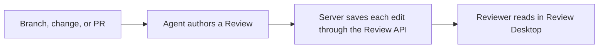

# How Review works

<!--
Outline: Product model -> Review contents -> Pins -> Publication -> Lifecycle -> Storage.
-->

Review separates authoring from reading. A coding agent studies a change and
writes a guided document; Review Desktop gives the human reviewer live code,
and system views around that document.



## A Review is more than a diff

Each Review can combine:

- concise prose about intent, architecture, data flow, and risk;
- source links and code peeks anchored to exact files and line ranges;
- editor navigation such as hover and go-to-definition;
- sequence diagrams and database access views;
- a software map from systems down to code elements.

The changed-file diff remains available in the Files tab, but it is supporting
evidence rather than the only way to understand the change.

## Changes are pinned before authoring

A Review binds to one unit of change: a Git branch, Jujutsu bookmark, Jujutsu
change ID, or GitHub pull request. Scaffolding resolves and pins exact base and
head commits, then prepares Review-owned checkouts for them.

The agent reads those pinned checkouts while it writes. Moving your current
checkout does not silently change the code being reviewed. Use `review_repin`
(or the equivalent `review api` command) to start a fresh version at updated
pins when the bound branch, change, or pull request moves.

## Every edit saves immediately

Authoring goes through the JSON API: `review api`, the Review MCP tools, or
the dev-review skill. Every accepted edit is saved as soon as it is applied;
there is no publish, checkpoint, or render-report step. See
`packages/review/skills/dev-review/SKILL.md`
and `packages/review/src/review-api/README.md`
for the full authoring workflow.

The published document is `.bundle/document/review-document.json`, with format
`review-document/1` and a version-2 manifest. Software-map bundles contain
`head-map.json` and `base-map.json`, with format `software-map/1`. The server
serves JSON and the canvas renders it with built-in components, without
executing authored document or map JavaScript. The local server may evaluate
legacy sealed JavaScript during migration to this JSON format; the renderer
remains JSON-only.

## Reviews have an explicit lifecycle

| State             | What happens next                                                                   |
| ----------------- | ------------------------------------------------------------------------------------ |
| `draft`           | The agent authors the Review through the Review API; every accepted edit is saved.   |
| `awaiting-review` | The reviewer reads the Review or dismisses it.                                       |

Reviews created by earlier versions may also be `awaiting-agent-updates`,
`accepted`, or `rejected`. Accepted and rejected Reviews cannot be republished.

Explicit artifact repair is not a lifecycle transition. An accepted or rejected
Review can have its current artifacts repaired while remaining terminal;
ordinary document and map publication still reject terminal Reviews.

## Migration and current-presentation repair

Review upgrades supported schema-2/3/4 records to schema 5 on the first ordinary
store read: a Home scan, opening the Review, or a CLI lookup. It converts the
exact sealed artifacts at the current document and independent map pointers,
including terminal Reviews. It never recompiles editable `review.mdx` or
`data.ts`, or converts every private historical revision. Valid JSON artifacts
and absent maps are preserved; drafts without a presentation only need a record
upgrade. Repeat reads need no further migration. `review migrate apply` runs
the same per-review upgrade across the store and also performs repository-level
cleanup.

Migration validates and seals replacement artifacts before promoting them.
Transient mutation contention is reported as retryable busy, not corruption or
a reason to repair.

If sealed conversion fails, the record, authoring inputs, candidates, and
private refs stay unchanged. Home lists an attention entry: the review was
published with the removed MDX toolchain and its stored files are damaged, so
it cannot be imported. Delete it from Home and recreate it with the Review
skill. Malformed or unsupported records remain explicit list errors. A
current-schema Review with broken artifacts shows the same guidance in its
document or map load state.

Already-JSON historical revisions remain readable. Older pre-data revisions
show “This older revision is unavailable in this version of Review” with
**Open current review**, not a command to repair history.

## Reviews live locally

Authored Reviews are stored under:

```text
${DEV_REVIEW_HOME:-~/.dev}/reviews/<uuid>/
```

The directory contains the document, supporting TypeScript, pinned state,
sealed revisions, and disposable build output. Review owns the infrastructure
files; agents author content through the JSON API (`review api`, the Review
MCP tools, or the dev-review skill), never by editing files in this directory
directly.

`review.json` uses store schema 5 and records the independent document and map
presentation pointers. Candidate JSON bundles live under `.bundle/`; private
Git commits seal revisions and `.build/<revision>/` holds disposable
materializations. Immutable old history or a failed migration may still contain
legacy JavaScript. The local server can evaluate the exact sealed current
artifacts to migrate them; it serves JSON to the renderer rather than loading
that legacy code into the canvas.

Software maps are stored per commit in Git notes under
`refs/notes/dev-fast/*`. They do not add generated map files to the reviewed
branch. Map notes can be shared explicitly with `review map push` and
`review map fetch`.

See the [CLI reference](cli-reference.md) for the lifecycle commands and the
[privacy overview](privacy.md) for the local and network boundaries.
