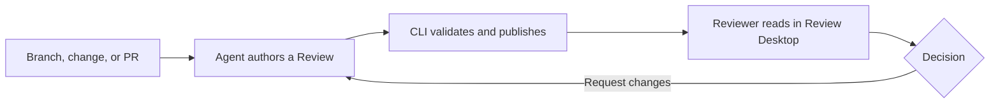

# How Review works

<!--
Outline: Product model -> Review contents -> Pins -> Publication -> Lifecycle -> Storage.
-->

Review separates authoring from reading. A coding agent studies a change and
writes a guided document; Review Desktop gives the human reviewer live code,
system views, and a structured feedback loop around that document.



## A Review is more than a diff

Each Review can combine:

- concise prose about intent, architecture, data flow, and risk;
- source links and code peeks anchored to exact files and line ranges;
- editor navigation such as hover and go-to-definition;
- sequence diagrams and database access views;
- a software map from systems down to code elements; and
- comment and question threads attached to the relevant evidence.

The changed-file diff remains available in the Files tab, but it is supporting
evidence rather than the only way to understand the change.

## Changes are pinned before authoring

A Review binds to one unit of change: a Git branch, Jujutsu bookmark, Jujutsu
change ID, or GitHub pull request. Scaffolding resolves and pins exact base and
head commits, then prepares Review-owned checkouts for them.

The agent reads those pinned checkouts while it writes. Moving your current
checkout does not silently change the code being reviewed. Run
`review scaffold --update` when the bound branch, change, or pull request moves.

## Publishing is a validation boundary

`review publish` compiles the Review document, checks its software-map
relationship, and resolves every source range against the pinned checkout. The
CLI seals a revision only after these checks pass. Review Desktop then mounts
the candidate before making it visible.

Authoring remains `review.mdx` and `data.ts`. The CLI keeps the MDX compiler,
TypeScript checks, esbuild, and Node-side validation runtime. It materializes
the validated document into schema-checked JSON before sealing it.

The published document is `.bundle/document/review-document.json`, with format
`review-document/1` and a version-2 manifest. Software-map bundles contain
`head-map.json` and `base-map.json`, with format `software-map/1`. The server
serves JSON and the canvas renders it with built-in components. Neither the
server nor the canvas executes agent-authored document or map JavaScript.

A failed publish does not replace the last good revision. The document can also
publish before its architecture map; `review map publish` validates and
promotes that artifact independently.

## Reviews have an explicit lifecycle

| State                    | What happens next                                          |
| ------------------------ | ---------------------------------------------------------- |
| `draft`                  | The agent authors and publishes the Review.                |
| `awaiting-review`        | The reviewer reads, asks questions, comments, and decides. |
| `awaiting-agent-updates` | The agent addresses submitted feedback and republishes.    |
| `accepted`               | The Review is complete and cannot be republished.          |
| `rejected`               | The Review is closed and cannot be republished.            |

An immediate question does not change the review state. **Request changes**
starts another agent round; **Approve** completes the Review.

Explicit artifact repair is not a lifecycle transition. An accepted or rejected
Review can have its current artifacts repaired while remaining terminal;
ordinary document and map publication still reject terminal Reviews.

## Migration and current-presentation repair

`review migrate apply` upgrades supported schema-2/3/4 records to schema 5.
It converts the exact sealed artifacts at the current document and independent
map pointers, including terminal Reviews. It never recompiles editable sources
or converts every private historical revision. Valid JSON artifacts and absent
maps are preserved; drafts without a presentation only need a record upgrade.

A failed conversion leaves the Review unchanged and reports a blocker. Home
keeps its migration warning and offers **Open recovery** for supported legacy
records. Opening recovery does not upgrade the record or execute legacy code.
Diff, Commits, Threads, and valid independent artifacts remain available when
their underlying data exists. Malformed or unsupported records remain blockers.

Use `review repair --review <uuid> --json` for explicit current-artifact recovery.
Repair tries the sealed artifacts first. If necessary, it can compile editable
authoring inputs with full pinned-range and evidence validation, or validate
saved map notes at the same pins. Reconcile unpublished edits before using
source-based repair: validation does not prove that those edits preserve what
the current Review says. Repair reports source fallback and does not overwrite
authoring files. Missing inputs remain an actionable failure.

Repair validates and mounts all required artifacts before promotion. Failures
retain the old presentation; concurrent changes and pending agent writes block
repair. Successful migration or repair preserves status, pins, title, threads,
dismissal, publication timestamps, and old history. Healthy current-schema
Reviews need no repair; unpresented drafts use ordinary publication instead.

Already-JSON historical revisions remain readable. Older pre-data revisions
show “This older revision is unavailable in this version of Review” with
**Open current review**, not a command to repair history.

## Reviews live locally

Authored Reviews are stored under:

```text
${DEV_REVIEW_HOME:-~/.dev}/reviews/<uuid>/
```

The directory contains the document, supporting TypeScript, pinned state,
thread database, sealed revisions, and disposable build output. Review owns the
infrastructure files; agents author `review.mdx` and `data.ts`, and use the CLI
for publication and threads.

`review.json` uses store schema 5 and records the independent document and map
presentation pointers. Candidate JSON bundles live under `.bundle/`; private
Git commits seal revisions and `.build/<revision>/` holds disposable
materializations. Immutable old history or a failed migration may still contain
legacy JavaScript; it is not loaded by the app.

Software maps are stored per commit in Git notes under
`refs/notes/dev-fast/*`. They do not add generated map files to the reviewed
branch. Map notes can be shared explicitly with `review map push` and
`review map fetch`.

See the [CLI reference](cli-reference.md) for the lifecycle commands and the
[privacy overview](privacy.md) for the local and network boundaries.
