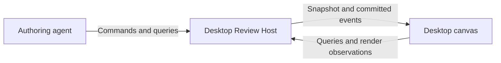

# How Review works

Review Desktop starts one local Review Host. Agents, the desktop canvas and other authorized local clients use the same API. The host owns the data; the desktop is a viewer and interaction surface.

## Structured documents

The canonical document is JSON: stable-ID nodes, shared definitions and retained source evidence. It can contain prose, typed source links, code peeks, collapsible sections, sequence diagrams, call-stack diffs, database read/write views, software maps, trace excerpts and images.

An agent updates a few nodes at a time through atomic commands. The host validates the proposed result before accepting it; the open canvas applies each complete commit without replacing unrelated content. No agent-authored MDX, TypeScript module or SQL runs in this path.

## Pinned evidence

A review binds to exact repository commits. Source paths are relative to that repository, not the author's home directory. Accepted source anchors retain their text and commit/blob identity. Moving the checkout does not silently change the review; unavailable source does not erase a saved code excerpt.

The Source browser reads pinned files, changed-file summaries and commits through the host API. The native editor is read-only and version-bound. Full language-server hover/go-to-definition support is not implied by basic source navigation.

Repinning is explicit: the host proposes range mappings, the author corrects changed/missing ranges, then applies the new binding atomically. The conservative remapper follows surviving contiguous lines and renames; it does not rewrite diagram meaning. Original document versions and source evidence remain immutable.

## Live versus published

Accepted mutations update the **Live** document. Publishing creates an immutable checkpoint of the document, metadata, binding and selected map versions. Historical checkpoint views ignore later live updates.

Maps are independently versioned host resources, not Git notes. A document may publish without maps; include exact map-version IDs in a later checkpoint when ready.

| Workflow | Meaning |
| --- | --- |
| `draft` | Not published |
| `in_review` | Published for the reader |
| `closed` | Closed; a human may explicitly reopen |

## Comments and questions

Comments, feedback submission and Ask are unavailable for JSON reviews in this authoring-only version. They are deferred to the third PR in this stack.

The authoring API and viewer do not provide Discussion, Add to review, Post
comment, Submit review or Ask now for JSON reviews. The trusted bundled
tutorial may still demonstrate its separate legacy question flow.

## Local ownership

New reviews share `$DEV_REVIEW_HOME/review-host.db`, default `~/.dev/review-host.db`. Clients use APIs, not this storage path. Old review directories/databases are left untouched and are not converted by this implementation. The bundled tutorial remains a trusted legacy UI exception.

This delivery is local-only: no hosted reviews, upload flow, public sharing, team login or cloud execution. The API and portable evidence model make those future additions possible without introducing a second document authority. See [Privacy](privacy.md) for local-agent and network boundaries.
