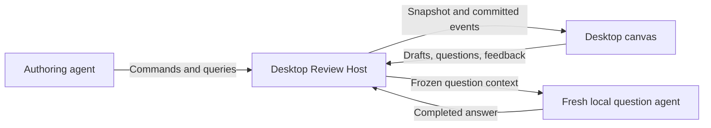

# How Review works

Review Desktop starts one local Review Host. Agents, the desktop canvas and other authorized local clients use the same API. The host owns the data; the desktop is a viewer and interaction surface.

## Structured documents

The canonical document is JSON: stable-ID nodes, shared definitions and retained source evidence. It can contain prose, typed source links, code peeks, collapsible sections, sequence diagrams, call-stack diffs, database read/write views, software maps, trace excerpts and images.

An agent updates a few nodes at a time through atomic commands. The host validates the proposed result before accepting it; the open canvas applies each complete commit without replacing unrelated content. No agent-authored MDX, TypeScript module or SQL runs in this path.

## Pinned evidence

A review binds to exact repository commits. Source paths are relative to that repository, not the author's home directory. Accepted source anchors retain their text and commit/blob identity. Moving the checkout does not silently change the review; unavailable source does not erase a saved code excerpt.

The Source browser reads pinned files, changed-file summaries and commits through the host API. The native editor is read-only and version-bound. Full language-server hover/go-to-definition support is not implied by basic source navigation.

New code is explicit: `review.revision.create` selects new commits and starts a blank canvas with no selected maps. Earlier material stays in history. Comment mapping can follow surviving contiguous lines and renames conservatively; ambiguous or deleted content remains attached to its original target rather than being guessed into a new location.

## Saved versions and lifecycle

Every accepted material change creates one immutable `reviewVersion` containing canvas, metadata, code commits and selected maps. The live canvas follows the latest version; historical views remain fixed. No separate publish/readiness step exists.

Maps are independently versioned host resources, not Git notes. Saving or editing a map does not change a review's selection. Select an exact map version explicitly, or embed it in a canvas node.

`review.version.restore` copies an earlier complete snapshot into a new version, including its code and maps. It does not erase later history or discussions, reopen the review, or transfer approval. Open/closed and trash state are separate from saved material and feedback decisions.

## Comments and questions

- **Add to review** saves a private editable draft. It does not launch an agent.
- **Post comment** creates a visible thread immediately.
- **Submit review** atomically shares selected saved drafts and a decision tied to the exact viewed version. Submission does not depend on an online author.
- **Ask now** saves a question, then opens a fresh supported local agent alongside the review. Its context is the observed document/evidence and saved conversation, not a fork of the original author.

Posted questions and replies are immutable; corrections are follow-ups. Completed answers are saved in the host even if the terminal is later closed. Launch failures remain visible. After restart an unfinished run may be marked interrupted and retried explicitly; automatic resumption, partial-answer streaming and a Stop button are not provided.

## Local ownership

New reviews share `$DEV_REVIEW_HOME/review-host.db`, default `~/.dev/review-host.db`. Clients use APIs, not this storage path. Old review directories/databases are left untouched and are not converted by this implementation. The bundled tutorial remains a trusted legacy UI exception.

This delivery is local-only: no hosted reviews, upload flow, public sharing, team login or cloud execution. The API and portable evidence model make those future additions possible without introducing a second document authority. See [Privacy](privacy.md) for local-agent and network boundaries.
