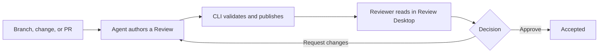

# How Review works

<!--
Outline: Product model -> Review contents -> Pins -> Publication -> Lifecycle -> Storage.

TODO(docs):
- Link to one real public Review that demonstrates prose, code peeks, and a map.
- Add a product screenshot beside the lifecycle after the launch UI is frozen.
- Confirm how much of the local storage model should be user-facing long term.
-->

Review separates authoring from reading. A coding agent studies a change and
writes a guided document; Review Desktop gives the human reviewer live code,
system views, and a structured feedback loop around that document.



## A Review is more than a diff

Each Review can combine:

- concise prose about intent, architecture, data flow, and risk;
- source links and code peeks anchored to exact files and line ranges;
- editor navigation such as hover and go-to-definition;
- sequence diagrams and database access views;
- a software map from systems down to code elements; and
- comment and question threads attached to the relevant evidence.

The changed-file diff remains available in the Files tab, but it is supporting
evidence rather than the only way to understand the change.

## Changes are pinned before authoring

A Review binds to one unit of change: a Git branch, Jujutsu bookmark, Jujutsu
change ID, or GitHub pull request. Scaffolding resolves and pins exact base and
head commits, then prepares Review-owned checkouts for them.

The agent reads those pinned checkouts while it writes. Moving your current
checkout does not silently change the code being reviewed. Run
`review scaffold --update` when the bound branch, change, or pull request moves.

## Publishing is a validation boundary

`review publish` compiles the Review document, checks its software-map
relationship, and resolves every source range against the pinned checkout. The
CLI seals a revision only after these checks pass. Review Desktop then mounts
the candidate before making it visible.

A failed publish does not replace the last good revision. The document can also
publish before its architecture map; `review map publish` validates and
promotes that artifact independently.

## Reviews have an explicit lifecycle

| State | What happens next |
| --- | --- |
| `draft` | The agent authors and publishes the Review. |
| `awaiting-review` | The reviewer reads, asks questions, comments, and decides. |
| `awaiting-agent-updates` | The agent addresses submitted feedback and republishes. |
| `accepted` | The Review is complete and cannot be republished. |
| `rejected` | The Review is closed and cannot be republished. |

An immediate question does not change the review state. **Request changes**
starts another agent round; **Approve** completes the Review.

## Reviews live locally

Authored Reviews are stored under:

```text
${DEV_REVIEW_HOME:-~/.dev}/reviews/<uuid>/
```

The directory contains the document, supporting TypeScript, pinned state,
thread database, sealed revisions, and disposable build output. Review owns the
infrastructure files; agents author `review.mdx` and `data.ts`, and use the CLI
for publication and threads.

Software maps are stored per commit in Git notes under
`refs/notes/dev-fast/*`. They do not add generated map files to the reviewed
branch. Map notes can be shared explicitly with `review map push` and
`review map fetch`.

See the [CLI reference](cli-reference.md) for the lifecycle commands and the
[privacy overview](privacy.md) for the local and network boundaries.
