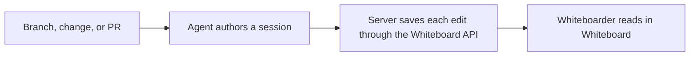

# How Whiteboard works

<!--
Outline: Product model -> Whiteboard contents -> Targets -> Publication -> Lifecycle -> Storage.
-->

Whiteboard separates authoring from reading. A coding agent studies a change and
writes a guided document; Whiteboard gives the human reviewer live code,
and system views around that document.



## A session is more than a diff

Each session can combine:

- concise prose about intent, architecture, data flow, and risk;
- source links and code peeks anchored to exact files and line ranges;
- editor navigation such as hover and go-to-definition;
- sequence diagrams and database access views;
- a software map from systems down to code elements.

The changed-file diff remains available in the Files tab, but it is supporting
evidence rather than the only way to understand the change.

## Live and pinned worktrees

A live session follows saved files in your existing worktree, including when viewing
older authored versions. You are responsible for updating references as source changes.
Language services use that checkout’s project and dependencies. A commit session keeps source fixed
and uses Whiteboard-owned worktrees pinned to its commits, running `devfast.prepare`
to set up dependencies. Choose live for ongoing work and pinned for a fixed comparison.

Session source is read-only.
Language services require matching environment buffers and use the current
project's dependencies for live sessions.
See [session targets](cli-reference.md#session-targets) for the API options.

## Every edit saves immediately

Authoring goes through the JSON API: `whiteboard api`, the Whiteboard MCP tools, or
the whiteboard skill. Every accepted edit is saved as soon as it is applied;
there is no publish, checkpoint, or render-report step. See
`packages/whiteboard/skills/whiteboard/SKILL.md`
and `packages/whiteboard/src/session-api/README.md`
for the full authoring workflow.

The published document is `.bundle/document/whiteboard-document.json`, with format
`whiteboard-document/1` and a version-2 manifest. Software-map bundles contain
`head-map.json` and `base-map.json`, with format `software-map/1`. The server
serves JSON and the canvas renders it with built-in components, without
executing authored document or map JavaScript. The local server may evaluate
legacy sealed JavaScript during migration to this JSON format; the renderer
remains JSON-only.

## Sessions have an explicit lifecycle

| State             | What happens next                                                                   |
| ----------------- | ------------------------------------------------------------------------------------ |
| `draft`           | The agent authors the session through the Whiteboard API; every accepted edit is saved.   |
| `awaiting-review` | The reviewer reads the session or dismisses it.                                       |

Sessions created by earlier versions may also be `awaiting-agent-updates`,
`accepted`, or `rejected`. Accepted and rejected sessions cannot be republished.

Explicit artifact repair is not a lifecycle transition. An accepted or rejected
session can have its current artifacts repaired while remaining terminal;
ordinary document and map publication still reject terminal sessions.

## Migration and current-presentation repair

Whiteboard upgrades supported schema-2/3/4 records to schema 5 on the first ordinary
store read: a Home scan, opening the session, or a CLI lookup. It converts the
exact sealed artifacts at the current document and independent map pointers,
including terminal sessions. It never recompiles editable `review.mdx` or
`data.ts`, or converts every private historical revision. Valid JSON artifacts
and absent maps are preserved; drafts without a presentation only need a record
upgrade. Repeat reads need no further migration. `whiteboard migrate apply` runs
the same per-review upgrade across the store and also performs repository-level
cleanup.

Migration validates and seals replacement artifacts before promoting them.
Transient mutation contention is reported as retryable busy, not corruption or
a reason to repair.

If sealed conversion fails, the record, authoring inputs, candidates, and
private refs stay unchanged. Home lists an attention entry: the review was
published with the removed MDX toolchain and its stored files are damaged, so
it cannot be imported. Delete it from Home and recreate it with the Whiteboard
skill. Malformed or unsupported records remain explicit list errors. A
current-schema session with broken artifacts shows the same guidance in its
document or map load state.

Already-JSON historical revisions remain readable. Older pre-data revisions
show “This older revision is unavailable in this version of Whiteboard” with
**Open current review**, not a command to repair history.

## sessions live locally

Authored sessions are stored under:

```text
${DEV_WHITEBOARD_HOME:-~/.dev}/reviews/<uuid>/
```

The directory contains the document, supporting TypeScript, pinned state,
sealed revisions, and disposable build output. Whiteboard owns the infrastructure
files; agents author content through the JSON API (`whiteboard api`, the Whiteboard
MCP tools, or the whiteboard skill), never by editing files in this directory
directly.

`review.json` uses store schema 5 and records the independent document and map
presentation pointers. Candidate JSON bundles live under `.bundle/`; private
Git commits seal revisions and `.build/<revision>/` holds disposable
materializations. Immutable old history or a failed migration may still contain
legacy JavaScript. The local server can evaluate the exact sealed current
artifacts to migrate them; it serves JSON to the renderer rather than loading
that legacy code into the canvas.

Software maps are stored per commit in Git notes under
`refs/notes/dev-fast/*`. They do not add generated map files to the reviewed
branch. Map notes can be shared explicitly with `whiteboard map push` and
`whiteboard map fetch`.

See the [CLI reference](cli-reference.md) for the lifecycle commands and the
[privacy overview](privacy.md) for the local and network boundaries.
