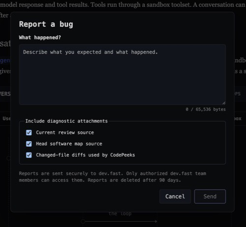

# Privacy

<!--
Outline: Local data -> Anonymous telemetry -> Errors -> Agent providers
-> Explicit bug reports -> Opt-out -> Developer inspection.

TODO(docs):
- Add a public privacy contact or policy URL.
-->

Review reads source code and agent-authored documents from your machine. This
page separates the local product data, anonymous telemetry, connected coding
agents, and explicit bug reports.

For the exact event schemas and implementation references, see the full
[telemetry reference](telemetry.md).

## What stays local

Review stores authored Reviews under
`~/.dev/reviews/<uuid>/` and keeps desktop discovery and
state under `~/.dev/review-desktop/` by default.

Passive product telemetry never includes:

- source code or changed-file diffs;
- paths, repository names, refs, symbols, or declarations;
- review documents, comments, questions, or thread text;
- prompts or model output; or
- email, username, hostname, or a machine identifier.

The canvas talks to Review's local server. It does not connect directly to
PostHog.

## Anonymous product telemetry

Anonymous telemetry is enabled by default. Review creates a random installation
UUID and does not associate it with a person profile.

Telemetry can include closed enums, booleans, counts, durations, the Review and
app versions, operating-system and architecture categories, feature usage, and
sanitized product errors. PostHog may derive coarse location at ingestion, but the
project discards the source IP.

Pending events are stored in a bounded local queue under
`~/.dev/telemetry/events` by default. Review retries temporary
delivery failures and removes pending events after seven days.

## Error reports

Review can automatically report failures in its own app, canvas, server, or
background process. These reports may contain an error class, a cleaned message,
a one-way fingerprint, and up to ten stack frames from Review's own program.

Before sending, Review cleans paths, home and temporary directories, web
addresses, email addresses, and known secret formats. It drops repository,
dependency, and extension stack frames. It also drops any message that quotes a
Review document or does not pass a second local path-and-secret check.

## User-initiated bug reports

The **Report bug** dialog sends a report only after you select **Send**.



Under **Include diagnostic attachments**, three independent checkboxes control
whether Review attaches:

- the current Review source
- the head software-map source
- changed-file diffs used by the review codepeeks (only the diff lines)

You can turn off any or all of them before sending.

The checkboxes control only those optional attachments. Every submitted report
also includes the description, app and CLI versions, operating-system category,
a random app-session ID, and up to 20 sanitized JavaScript error class names
seen during that canvas session. It does not include error messages in that
list.

If a selected attachment is unavailable, Review omits it and sends the other
available data. The report never attaches Review metadata, comment threads, or
question threads. Review stores submitted reports in a private /dev/fast
Cloudflare R2 bucket and deletes them after 90 days.

An explicit bug report is separate from passive telemetry and is sent even when
anonymous telemetry is disabled. Review shows the attachment choices before
submission.

## Turn telemetry off

In Review Desktop, open **Preferences → Settings** and disable **Share anonymous
usage data**. That setting controls both the app and CLI on the same
installation.

For a process or headless environment, set a supported opt-out variable:

```sh
DO_NOT_TRACK=1 review info
```

`DNT=1` and the Review-specific variables listed in the
[telemetry reference](telemetry.md#identity-and-control) are also supported.

## Inspect events during development

Set the debug sink before launching Review Desktop:

```sh
DEV_FAST_REVIEW_TELEMETRY_DEBUG=1 review app launch
```

Review prints each event to stderr instead of sending it to PostHog. See
[Developer sink](telemetry.md#developer-sink) for its exact behavior.
