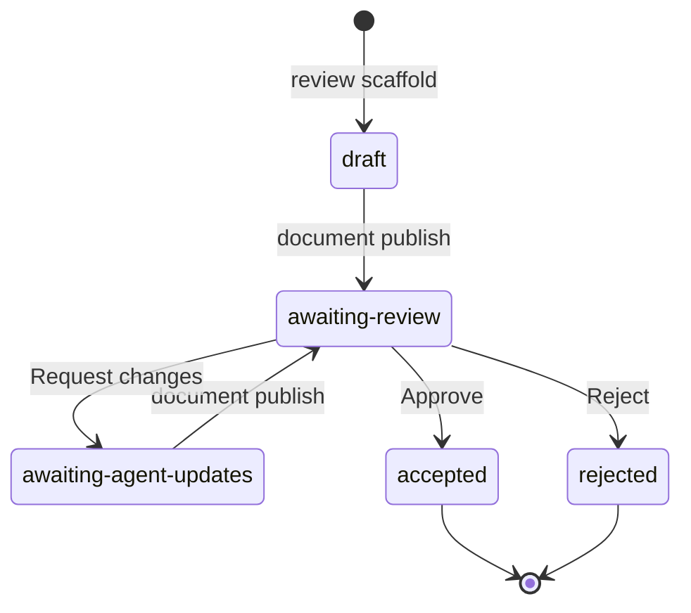

# dev.fast Review

The `review` app and CLI let a user engage with complex AI-generated changes through two independent artifacts:

- an MDX Review document with exact source ranges and document-owned diagrams
- a C4-inspired software map

At a high level: discover or scaffold the Review, dispatch a software-map worker, author and publish the document, publish the map when the worker finishes, then iterate on reviewer feedback. Document publication never waits for the map.

A `review.mdx` file is associated with (in order of specificity) a repo, a git worktree/jj workspace, and an AI agent session.

## DEV-REVIEW.md

If `DEV-REVIEW.md` exists at the repo root, read it before any other review work and follow its instructions. It holds the user's review rules and domain language. Respect the rules in that document.

## Parallel software-map worker

After scaffold resolves the Review UUID and pinned commits, delegate software-map authoring to one sub-agent. The main agent must not author the map.

Give the worker the source worktree, Review UUID, Review directory, `baseCommit`, and `sourceCommit`. Tell it to use `$dev-review-map`, edit only map scratch files, and return only after both `review map check` commands pass.

The main agent owns `review.mdx`, `data.ts`, document publication, the final `review map publish`, and reviewer feedback. It continues document work while the map worker runs. This separation avoids file overlap and prevents map work from delaying the first document publication.

Use this worker prompt with resolved values:

```text
Use $dev-review-map in <source-worktree>.

Review UUID: <uuid>
Review directory: <review-dir>
Base commit: <baseCommit>
Head commit: <sourceCommit>

Author and save both software maps.
Do not edit review.mdx or data.ts.
Do not publish the Review document or software map.
Return only after both `review map check <rev> --review <uuid>` commands pass.
```

After the worker succeeds, the main agent runs `review map publish --review <uuid> --json`. If the Review became terminal, report the valid unpublished-map state and do not retry.

If no sub-agent facility exists, publish the document and report that the map remains unpublished. Do not silently move map authoring into the main agent.

## In-app Ask replies

When the prompt starts with `dev-review-thread-id: <id>`, answer that Review
thread. Run `review threads get <id>` from the source worktree. Treat its
target and complete message list as the canonical context. Read the Review
document or repository files only when the question requires them.

Do not modify files. Do not publish, resolve, or reply through the CLI. Review
Desktop stores your returned text in the same thread. Return only the answer
to the user message that follows the header.

## Writing a great review

The H1 is the review's display title in Review Desktop tabs and Home. Write a short, specific title for the change (for example, "Publish pipeline: single mount"), not a generic one. Publishing syncs the title. Use progressive disclosure: short prose first, then details that earn their cost. Typical useful sections are interface change, lifecycle/data flow, state/storage, and testing evidence. Write in ASD-STE100 Simplified Technical English (STE).

Assume raw prose will confuse the reader. Spend substantial reasoning effort deciding what to omit, rather than what to include; deep analysis followed by a small amount of clear output text is the correct tradeoff. Start brief and add resolution only where it earns the reader's attention; the reader's time and attention are incredibly expensive and thus every word you put out taxes and pains them. Your job is to not waste that time. A useful trick is to write in ASD-STE100 Simplified Technical English (STE). Think about the style of RFCs from great tech leaders like Russ Cox, Dave Cheney, and the early React RFCs.

- Remember that the reader can ONLY see the 'user' prompts _before_ coding started and the document you write to explain what changed. This means jargon in the middle - references to specific parts of code, especially any and all abstractions, changes, and code referenced _during_ the editing process - is confusing and not helpful. More words do not help. Progressive disclosure of complexity is key.

1. In order to help a human understand a diff, there are likely <5 sections they would want to see in the markdown. This is a heuristic, not a hard requirement; use your best judgement and ask the user if you're unsure.
2. Here are some high-level sections which might be helpful (but are not limited to): dataflow/lifecycle, state model, architecture boundary, storage, risks.

- risks, in particular, are tricky to get right. Models tend to state obvious ones ('untested' x LOC) which are easy to catch, and miss important ones (customer X uses this workflow and we're not accounting for it). Risk assessment is fundamentally a question of user impact; you should ask for more context here instead of guessing before deciding on risks.
- These are three sections which are almost always relevant (esp. for larger changes):
  - **Interface change** — show any changed contract as its caller sees it (signature, RPC/HTTP/JSON shape, CLI flag, config, or event), with a short code example and a link to a real consumer.
  - **Testing** — connect the main claims to linked test evidence and say what remains unpinned.
  - **Decision Log** — split into two components:
    1. Collect and dedupe the invariants the user expressed to you in the prompt _in their own words_. Later decisions can semantically overwrite earlier ones.
    2. Decisions that you made during implementation. State them in plain language (ASD-STE100 Simplified Technical English).

## SDK Reference (data.ts file)

The `data.ts` file is the data layer of the review documents.

- The review runtime provides a typed SDK for source ranges and document-owned diagrams. It is available under the `virtual:progressive-review-authoring` module.
- Anchor props take `defineAnchors` references, never strings. Do not use
  casts, `any`, `<Participant>`, or `<Message>`.
- Do not import run-time values from local files. Put TypeScript-only support
  code in `data.ts`.

These are the supported runtime exports and their canonical input schemas:

```ts
export const defineActors = session.defineActors;
export const defineAnchors = session.defineAnchors;
export const defineStores = session.defineStores;

export const actorInputSchema = z.strictObject({
  label: nonEmptyStringSchema,
  softwareMapPath: optionalNonEmptyStringSchema,
});
export type ActorInput = z.infer<typeof actorInputSchema>;

export const actorInputMapSchema = z.record(
  nonEmptyStringSchema,
  actorInputSchema,
);
export type ActorInputMap = z.infer<typeof actorInputMapSchema>;

const codePeekCommonShape = {
  theme: z.enum(["system", "light", "dark"]).optional(),
  graph: z.enum(["head", "base"]).optional(),
  children: noChildrenSchema,
};

export const codePeekRangeInputSchema = z
  .strictObject({
    file: nonEmptyStringSchema,
    fromLine: z.int().positive(),
    toLine: z.int().positive(),
    ...codePeekCommonShape,
  })
  .refine((value) => value.toLine >= value.fromLine, {
    path: ["toLine"],
    message: "Must be greater than or equal to fromLine",
  });

export const codePeekPropsSchema = codePeekRangeInputSchema;

export const anchorInputSchema = z.strictObject({
  title: nonEmptyStringSchema,
  peek: codePeekPropsSchema.optional(),
  detail: optionalNonEmptyStringSchema,
  softwareMapPath: optionalNonEmptyStringSchema,
});

export const anchorInputMapSchema = z.record(
  nonEmptyStringSchema,
  z.union([nonEmptyStringSchema, anchorInputSchema]),
);
export type AnchorInputMap = z.infer<typeof anchorInputMapSchema>;

const softwareDataStoreForeignKeyRefSchema = z.union([
  nonEmptyStringSchema,
  z.strictObject({
    table: nonEmptyStringSchema,
    field: nonEmptyStringSchema,
    label: optionalNonEmptyStringSchema,
    cardinality: z.enum(["one-to-one", "many-to-one"]).optional(),
    onDelete: optionalNonEmptyStringSchema,
    onUpdate: optionalNonEmptyStringSchema,
  }),
]);
const softwareDataStoreFieldSchema: z.ZodType<SoftwareDataStoreFieldSchema> =
  z.lazy(() =>
    z.record(
      nonEmptyStringSchema,
      z.union([
        z.strictObject({
          type: nonEmptyStringSchema,
          example: z.unknown().optional(),
          pk: z.boolean().optional(),
          fk: softwareDataStoreForeignKeyRefSchema.optional(),
          schema: softwareDataStoreFieldSchema.optional(),
        }),
        softwareDataStoreFieldSchema,
      ]),
    ),
  );

export const softwareDataStoreCollectionInputSchema = z.strictObject({
  label: optionalNonEmptyStringSchema,
  key: optionalNonEmptyStringSchema,
  schema: softwareDataStoreFieldSchema,
});
const softwareDataStoreCollectionMapSchema = z.record(
  nonEmptyStringSchema,
  softwareDataStoreCollectionInputSchema,
);
export const storeKindSchema = z.enum(["relational", "document"]);
export const storeInputSchema = z.strictObject({
  kind: storeKindSchema,
  label: nonEmptyStringSchema,
  dataStoreKind: softwareDataStoreKindSchema.optional(),
  softwareMapPath: optionalNonEmptyStringSchema,
  tables: softwareDataStoreCollectionMapSchema.optional(),
  documents: softwareDataStoreCollectionMapSchema.optional(),
});

export const storeInputMapSchema = z.record(
  nonEmptyStringSchema,
  storeInputSchema,
);
export type StoreInputMap = z.infer<typeof storeInputMapSchema>;
```

Use the smallest source range that proves the claim. Do not use a broad region.
Read the range from the correct pinned worktree before you add the anchor.

## MDX Component Reference (review.mdx file)

The `review.mdx` file is the presentation layer of the review documents.

`SequenceDiagram` is more useful than prose for temporal behavior and
`DatabaseLens` for persisted-state changes. Visuals are cheaper to understand than prose.

Default to `AnchorLink` for source evidence. Use `CodePeek` only when readers
must see the code inline to understand the main claim.

- MDX uses JavaScript grammar.
- Write diagram inputs in `data.ts` instead; component schemas validate them.
- Every sequence message needs anchored peek or inline-code evidence.
- You're not limited the components below, although they are included by default. You are free to write any valid MDX that you would like to include to communicate the software system to the user, including arbitrary React + MDX.

These are the canonical prop schemas. `DbRead` and `DbWrite` both use
`dbOperationPropsSchema`.

```ts
const sequenceMessageBaseShape = {
  from: sequenceActorInputSchema,
  to: sequenceActorInputSchema,
  label: nonEmptyStringSchema,
};
export const sequenceMessageInputSchema = z.union([
  z.strictObject({
    ...sequenceMessageBaseShape,
    anchor: peekableAnchorRefSchema,
    code: sequenceMessageCodeInputSchema.optional(),
  }),
  z.strictObject({
    ...sequenceMessageBaseShape,
    anchor: anchorRefSchema.optional(),
    code: sequenceMessageCodeInputSchema,
  }),
]);

export const sequenceDiagramPropsSchema = z.strictObject({
  label: nonEmptyStringSchema,
  messages: z.array(sequenceMessageInputSchema).min(1),
  children: noChildrenSchema,
});

export const reviewCodePeekPropsSchema = z.strictObject({
  anchor: peekableAnchorRefSchema,
  children: noChildrenSchema,
});

export const anchorLinkPropsSchema = z.strictObject({
  anchor: peekableAnchorRefSchema,
  children: reactNodeSchema,
});

export const reviewSectionPropsSchema = z.strictObject({
  title: nonEmptyStringSchema,
  defaultCollapsed: z.boolean().optional(),
  children: reactNodeSchema,
});

export const dbUseCasePropsSchema = z.strictObject({
  id: nonEmptyStringSchema,
  label: nonEmptyStringSchema,
  summary: optionalNonEmptyStringSchema,
  children: reactNodeSchema,
});

export const dbOperationPropsSchema = z.strictObject({
  from: z.union([actorRefSchema, targetRefSchema]),
  to: z.union([actorRefSchema, targetRefSchema]),
  label: nonEmptyStringSchema,
  anchor: peekableAnchorRefSchema,
  children: noChildrenSchema,
});

export const databaseLensPropsSchema = z.strictObject({
  title: optionalNonEmptyStringSchema,
  stores: z.record(
    nonEmptyStringSchema,
    z.custom<StoreRef>(
      (value) =>
        Boolean(value) &&
        typeof value === "object" &&
        (value as { __kind?: unknown }).__kind === "db-store-ref" &&
        typeof (value as { id?: unknown }).id === "string" &&
        typeof (value as { label?: unknown }).label === "string",
      "Must be a store reference returned by defineStores",
    ),
  ),
  height: z.number().positive().optional(),
  children: reactNodeSchema,
});
```

### CallStackDiff (call-flow evidence)

`CallStackDiff` renders two authored call stacks as one git-diff-styled
stack. Removed frames print `-`, added frames print `+`, shared frames are
context. Every frame is a live link: a click opens that anchor's peek.

```ts
export const callStackDiffPropsSchema = z
  .strictObject({
    title: optionalNonEmptyStringSchema,
    base: z.array(z.union([peekableAnchorRefSchema, callsAssertionSchema])),
    head: z.array(z.union([peekableAnchorRefSchema, callsAssertionSchema])),
    children: noChildrenSchema,
  })
  .superRefine(/* side rules below */);
```

Rules:

1. List order is the stack. Each frame calls the one below it.
2. Define one anchor per frame. Point its peek at the call site or the
   function head.
3. The diff is positional over anchor identity. A shared frame is one head
   anchor listed in both `base` and `head`; it renders as context and opens
   the new code.
4. A frame only in `base` is a removed call. Its anchor must set
   `graph: "base"` so the `-` row opens the old code. The schema rejects a
   head-graph anchor that appears only in `base`, and any base-graph anchor
   in `head`.
5. Use `calls(parent, child, reason?)` in place of a frame when the hop is
   hard to follow by eye (queues, callbacks, RPC). It renders the child
   frame with a dashed `≈` marker; hover shows parent, child, and reason.
6. One component holds one linear stack. Use two components for two flows.
7. A `-` row is a claim of removal and a `+` row a claim of addition.
   Publish checks each against the pinned diff: a `-` frame must anchor a
   range with deleted lines, and a `+` frame a range with added lines.
   Anchor the removed or added call site. Do not list a frame on one side
   for contrast — publish rejects it.

```mdx
<CallStackDiff
  title="Warm allocation"
  base={[anchors.reconcile, anchors.auth, anchors.enqueueWork]}
  head={[
    anchors.reconcile,
    anchors.enqueueWork,
    calls(anchors.enqueueWork, anchors.processItem, "dispatched via the workqueue"),
  ]}
/>
```

The stacks are authored claims, like prose — nothing verifies the edges.
Publish still resolves every anchor against its pinned worktree, so a
frame that points at code that does not exist fails the publish.

### Example document

`${DEV_REVIEW_HOME}/reviews/${uuid}/data.ts`

```ts
import {
  defineActors,
  defineAnchors,
} from "virtual:progressive-review-authoring";

export const actors = defineActors({
  agent: { label: "Agent" },
  desktop: { label: "Desktop" },
});

export const anchors = defineAnchors({
  resolveThing: {
    title: "Resolver",
    peek: { file: "src/resolve.ts", fromLine: 12, toLine: 28 },
  },
  publish: {
    title: "Publish",
    peek: { file: "src/publish.ts", fromLine: 40, toLine: 66 },
  },
});

export const messages = [
  {
    from: actors.agent,
    to: actors.desktop,
    label: "Publish candidate",
    anchor: anchors.publish,
  },
];
```

`${DEV_REVIEW_HOME}/reviews/${uuid}/review.mdx`

```mdx
import { anchors, messages } from "./data.ts";

<CodePeek anchor={anchors.resolveThing} />

See <AnchorLink anchor={anchors.publish}>the publish implementation</AnchorLink>
for supporting evidence.

<SequenceDiagram label="Publish" messages={messages} />
```

## Disk layout

A review has one canonical UUID directory under
`${DEV_REVIEW_HOME:-~/.dev}/reviews/<uuid>/`. The directory contains
the source document, the review state, and the history of the document.

```text
${DEV_REVIEW_HOME:-~/.dev}/reviews/
└── <uuid>/
    ├── review.mdx
    ├── data.ts
    ├── review.json
    ├── review.db              # Comment threads and drafts (SQLite).
    ├── package.json
    ├── review-test.mjs
    ├── .gitignore
    ├── .bundle/
    │   ├── document/          # Current document candidate.
    │   └── software-map/      # Current map candidate, when present.
    ├── .build/
    │   └── <revision>/        # An exact, temporary artifact copy.
    └── .git/
```

- Agent-Owned Files: agents are allowed to modify the following files:
  - `review.mdx` is the main Review document. Edit this file.
  - `data.ts` contains optional TypeScript support code. Use this file only for
    TypeScript support code.
- Review Infrastructure: the following files are read-only infra files. Do not directly edit any of them except (incidentally) through 'review' CLI commands:
  - `review.json` contains the UUID, the source worktree, the pinned commits, the
    status, `presentedDocumentRevision`, and `presentedSoftwareMapRevision`.
  - `review.db` contains durable comment threads and comment drafts
    (SQLite). Read and mutate it only through `review threads` — never open or
    edit the storage directly.
  - `.bundle/document/` contains the current document candidate.
    `.bundle/software-map/` contains the current map candidate, when present.
    Review owns both directories.
  - `.build/<revision>/` contains a materialized document or map revision.
    Do not edit this directory. Review can make the directory again.
  - `package.json` and `review-test.mjs` supply the Review test interface. Review
    owns these files.
  - `.git/` contains the private Review document history. It is a normal Git
    repository, but Review owns its commits and refs. Do not use it as the source
    repository or mutate it directly.
  - `.gitignore` keeps `.build/` and the thread database out of the Review
    history.

`review migrate apply` converts supported Reviews to schema 3 and the split
bundle layout. The migration drops old question data. Private history can
retain older combined revisions. Active pointers and materialized artifacts
use the current layout. Do not edit migration records directly.

## Lifecycle

The reviewer only sees sealed revisions. `review publish` presents the
document. `review map publish` presents the software map independently.

The checkout's position never matters. Scaffold pins the head from the
review's binding (a branch, bookmark, change id, or PR). It materializes and
prepares dedicated worktrees for the pinned head and base. Sessions read those
worktrees, not the user's working tree. To review a GitHub PR,
scaffold with `--pr <number-or-url>` — and bind to the PR even when its
branch is checked out locally. A PR-bound review re-pins from GitHub on
`--update` and takes its base from the PR; a branch-bound review follows only
the local bookmark. When the bound change gains commits, run
`review scaffold --update` to re-pin (it is an upsert: with no existing
review it creates one). Publish never moves pins — it warns when they are
behind the bound change. During `--update`, scaffold reports each anchor whose
source file changed between the old and new pins. Re-read each reported file
in the new pinned worktree. Then adjust the range in `data.ts` if necessary.
A bare scaffold requires a named checkout (a branch,
bookmark, or change id); a detached HEAD needs `--head <ref>`.

1. Run `review app launch --json`. This command works outside a repository and
   does not need a terminal.
2. Run `review info --json` in the source worktree. If it reports no Review for
   the worktree, run `review scaffold --json` to create a new review document
   (under a new UUID path).
3. Read the JSONL output. Use its directory, unit of change, sync state, and
   open-thread count. The document is `<dir>/review.mdx`; the pinned commits
   live in `<dir>/review.json`.
4. Dispatch the dedicated software-map worker with the UUID, directory, and
   pinned commits. Do not wait for it before you author the document.
5. Edit `data.ts` and `review.mdx`. Before you add a code range, read its exact
   lines from `.git/dev-fast/worktrees/<commit-prefix>`. Use `sourceCommit` for
   a head range and `baseCommit` for a base range.
6. Run `review publish --json` in the source worktree. Always pass `--json`.
   Every `review` command accepts it.
   With `--json`, stdout carries only JSON events, one per line, and human
   progress goes to stderr. Failures also print a JSON error event on stdout.
7. If `review publish --json` fails, read the JSON error events. Every
   diagnostic is a hard error. A path outside the pinned worktree or a line
   range outside its file blocks publish.
   Correct the Review files and run the command again.
8. If `review publish` succeeds, Review records a new
   `presentedDocumentRevision`. It preserves `presentedSoftwareMapRevision`.
   A missing software map does not block document publication.
9. Join the map worker. If the Review is active, run
   `review map publish --review <uuid> --json`. This command preserves the
   document pointer and status. If the Review became terminal, report the
   valid document-only result and do not retry.
10. Run `review app pick --review <uuid> --json` to show the active Review.
11. Run one command that waits for a status that requires agent action:
   - `review wait --requires-agent --review <uuid>` with a backgrounded bash tool (harnesses like claude code)
   - `review wait --requires-agent --codex --review <uuid>` (the openai codex harness)
   - Depending on the state of the review:
     - `awaiting-agent-updates`: Read the threads, correct the Review, run `review scaffold --update` if the commits moved, and publish again.
     - `accepted`, `rejected`, and `review-deleted` end the loop, then end the turn.

```mermaid
sequenceDiagram
    participant Agent
    participant MapWorker as Map worker
    participant CLI as Review CLI
    participant Store as UUID Review directory
    participant Desktop
    participant Reviewer

    Agent->>CLI: review app launch --json
    CLI->>Desktop: start or activate the released app
    Agent->>CLI: review info or review scaffold
    CLI->>Store: discover or create the UUID binding
    Agent->>MapWorker: UUID and pinned commits
    Agent->>Store: edit data.ts and review.mdx
    Agent->>CLI: review publish --json --review <uuid>
    CLI->>Store: seal the document revision
    CLI->>Desktop: present document revision
    Desktop->>Store: set presentedDocumentRevision and awaiting-review
    MapWorker->>CLI: save checked base and head notes
    MapWorker-->>Agent: map checks pass
    Agent->>CLI: review map publish --json --review <uuid>
    CLI->>Store: seal the software-map revision
    CLI->>Desktop: present software-map revision
    Desktop->>Store: set presentedSoftwareMapRevision; preserve status
    Desktop-->>Reviewer: show document with optional map
    Agent->>CLI: review app pick --review <uuid> --json
    Agent->>CLI: review wait --requires-agent --review <uuid>
    Reviewer->>Desktop: comment, ask, submit, or dismiss
    Desktop->>Store: persist thread and status changes
    CLI-->>Agent: wait resolves with the new status
```

Do not run `npm test` directly. `review publish` gives the required private test
command to `review-test.mjs`.

## Architecture reviews

Most Reviews explain a change. A Review can also explain a codebase as it
stands — the reader asks for an "architecture review", or for the data flows,
access patterns, and code paths of a repo. There is no diff to walk, so:

1. Pin the same commit as base and head: `review scaffold --base <ref> --head
   <ref>` with one ref (`@` in jj, `HEAD` in git). An empty diff is expected
   and valid; the bundled tutorial Review is built this way.
2. Choose sections that describe the system, not a change. Data flow and
   lifecycle, the state and storage model, the boundaries between modules, and
   the paths a request or command takes are the useful ones. The
   interface-change, testing-evidence, and decision-log sections assume a diff
   — omit them.
3. Carry the weight in code peeks and diagrams rather than prose. A sequence
   diagram of the main path and peeks at the functions it names teach more
   than a written tour of the same code.
4. Scope it. A whole repo does not fit one document; name the subsystem in the
   H1 and say in the first paragraph what the review leaves out.

Everything else — the map worker, publish, the wait loop — is unchanged.

A Review binds to one unit of change: a git branch, a jj bookmark, or a jj
change id. Choose it deliberately with `review scaffold --head <name>` — a
bookmark for a document about a whole stack, a change id for a single-change
review. The base needs the same deliberateness: a bare scaffold defaults it
to the trunk fork point, which is correct only for work branched from trunk.
For a review in the middle of a stack, pass `--base <the branch directly
below>`; for a single-change review, pass the change's parent (`--base @-` in
jj, `--base <head>~1` in git). A wrong base is visible immediately as an
oversized diff, and `review scaffold --update --base <ref>` corrects it
without re-scaffolding. A bare `review scaffold` defaults to the bookmark on the checked-out
change (or its change id when unnamed); the scaffold output echoes the chosen
`change` so a wrong default is visible immediately. The binding is movable:
`review rebind <change> --review <uuid>` points the review at a different
bookmark, branch, or change id and re-pins from it immediately.

Use `review scaffold` when you need a new, separate Review for the same worktree.
`review info` is read-only discovery: it lists all Reviews for the current
worktree, or all worktrees in the repository with `--all`. Read each
`status` to determine who acts next. Then, run `review publish --review <uuid>`.

A newly scaffolded Review is `draft`. Desktop Home does not show a draft. Every
successful document publish sets status to `awaiting-review`. A map publish
does not change the status. The reviewer acts through three controls, each
valid only from `awaiting-review`. "Ask now" adds a draft comment and starts
an agent without a status change. "Request changes" submits the feedback and
sets `awaiting-agent-updates`. **Approve** sets `accepted`. **Dismiss** closes
the Review without changing its handoff status. Approve and Request changes
work with or without comments.

`accepted` and `rejected` are terminal: you cannot publish either Review
again. Desktop Home keeps every published Review visible through these
states. Use `review scaffold` if the work must continue.



`review wait --requires-agent` resolves on any status except `awaiting-review`
(`draft`, `awaiting-agent-updates`, `accepted`, `rejected`) or when the review
directory disappears — that last case is a distinct `review-deleted` event,
not a status.

`review publish` validates the document before it contacts Review Desktop. It
checks compilation and each source range against the pinned worktree. A map is
not part of this gate. A failed validation does not replace the last good
document revision. After promotion, the desktop mounts the document and
reports mount errors through the CLI.

A document re-publish requires zero open comment threads. Before each
re-publish, run `review threads list`. Address every open thread. Mark each
addressed thread with `review threads resolve <threadId> --review <uuid>`.
Run `review threads list` again. Do not re-publish until no comment thread has
`status: "open"`. The first document publication does not use this gate.

`review map publish` validates the saved base and head maps for the commits in
the presented document. It does not compile or publish the document. An
identical map publish reuses the existing map revision.

## Prepared worktrees (devfast.prepare)

Scaffold materializes one worktree per pinned commit (head and base) and runs
the repo's prepare commands in each. Prepared trees give editor language
servers working go-to-definition. The commands live in the repo's git
config as the multi-valued key `devfast.prepare` — unversioned, per clone, set
by the human or agent on the machine, never by the reviewed commits.

To configure `devfast.prepare`:

1. Inspect the repo's toolchain and match its lockfile exactly:
   `pnpm-lock.yaml` → `pnpm install --frozen-lockfile`; `package-lock.json` →
   `npm ci`; `yarn.lock` → `yarn install --immutable`; `uv.lock` → `uv sync`;
   `go.mod` → `go mod download`; `Cargo.lock` → `cargo fetch`.
2. `git config devfast.prepare '<install command>'` sets the first command.
   `git config --add devfast.prepare '<next command>'` appends more; commands
   run in file order.
3. Installing is often not enough. If workspace packages export from build
   output (`"exports"` pointing at `dist/`), imports of those packages stay
   unresolved until they are built — add a build step, scoped to library
   packages, for example `git config --add devfast.prepare
'pnpm -r --filter "./packages/**" run build'`. Exclude application targets;
   they are slow and unneeded.
4. Verify: after the next scaffold, the worktree under
   `.git/dev-fast/worktrees/<commit>` should resolve a workspace import
   (spot-check one `node_modules` symlink and the target's built artifacts).

Prepare failure is soft: scaffold warns and keeps the unprepared tree. The
warning includes the tail of the command output plus the full log
path (`<worktree>.prepare-log`). A `.prepared` marker beside each worktree
records the command-list hash; changing the config re-prepares automatically.
Config changes re-run prepare on the next `scaffold` or `scaffold --update`.

## Thread stores

Read and mutate thread state only through the CLI, run in the source worktree:

- `review threads list [--review <uuid>]` prints `{ review, comments }` as JSON.
- `review threads get <threadId> [--review <uuid>]` prints one submitted or
  draft comment thread as JSON. Without `--review`, it searches all Reviews in
  the source worktree.
- `review threads resolve <threadId> [--review <uuid>]` marks a comment thread
  resolved.
- `review threads reply <threadId> --body <text> [--review <uuid>]` appends a
  reply message to a comment thread.

`comments` is a map keyed by its own `threadId`:

```ts
type CommentThread = {
  threadId: string;
  target: ThreadTarget;
  status: "open" | "resolved";
  messages: Array<{
    id: string;
    by: string;
    at: string;
    body: string;
    role?: "reviewer" | "agent";
    format?: "plain" | "markdown";
  }>;
};
type Comments = Record<string, CommentThread>;
```

Do not invent, rewrite, or merge opaque targets. Resolve only the exact thread
after its document/code change is present. A re-publish fails while any comment
thread remains open.

## Migrations of Legacy Review State

Run `review migrate apply` to move legacy Review data. Do not use it for the
normal authoring workflow. The command converts supported Reviews to schema 3.
It also splits a valid combined revision into independent document and map
pointers. It drops legacy question state. It drops stored UUID Reviews whose
`data.ts` still defines removed `symbol` or `declarationId` peeks. It preserves
range-only Reviews. Use `--force` only to restart interrupted development state.

## Source and software-map rules

`review.json` is the source of truth for the commits and branches that a
software map represents.
Its `sourceBranch` is the bound unit of change and `sourceCommit`/`baseCommit`
are the pinned commits. `review publish` presents the pinned commits as
stored; when they are behind the bound change it warns to run
`review scaffold --update` first.

### Map Agent Prompt

> Non-interactively author the software map for this repository. Maps are
> per-commit git notes under `refs/notes/dev-fast/*`; never commit them to the
> source branch. Read the adjacent model declaration before editing. Model a C4
> structure with stable dot-path identities: people, systems, containers,
> components, and only important code elements. Resolve validation errors and
> report unrelated pre-existing warnings without expanding scope.
>
> Use the pinned commits from `review.json`. Run `review map open <base>`.
> Follow its provenance and work order. Run `review map check <base> --review <uuid>`. Then run
> `review map open <head>`. Apply only the target diff. Run
> `review map check <head> --review <uuid>`. Run `review map push` when origin is writable.
> Base must pass before head so head seeds from the pinned base map. If head
> provenance names another seed, check base and reopen head with `--force`.
> Do not edit `review.mdx` or `data.ts`. Do not publish either artifact.
